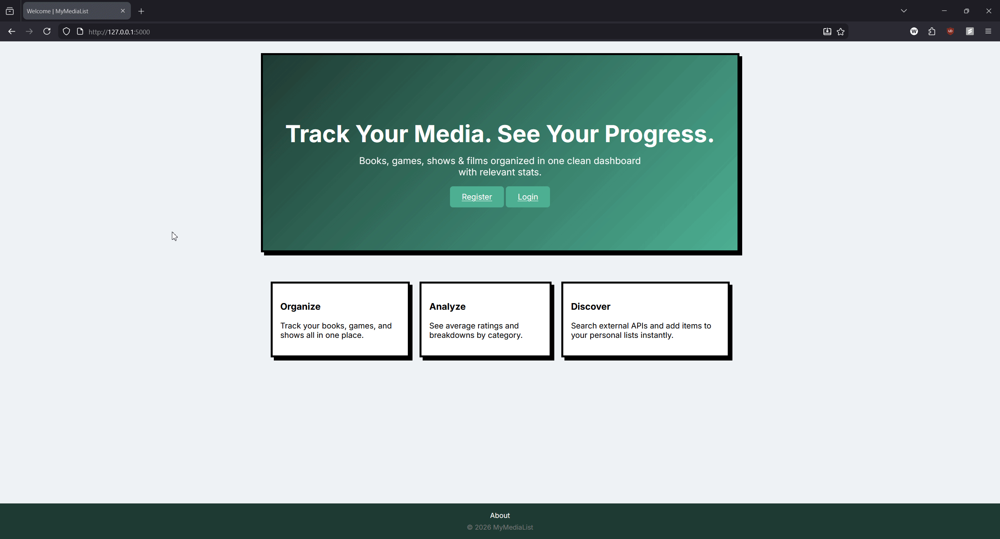

<h3 align="center">MyMediaList</h3>

<p align="center">
  A full-stack Flask web application for tracking books, games, shows, and movies from a single convenient hub.
</p>

<p align="center">

</p>

<!-- ABOUT THE PROJECT -->
# About The Project

MyMediaList is a unified media tracker for books, games, TV shows, and films.
<br><br>
Inspired by platforms like Goodreads and Letterboxd, it allows users to add media to personal lists, track progress, leave ratings and notes all in one place. 
<br><br>
Designed for people who consume media across multiple formats and want a single, organized dashboard for everything instead of being split across multiple. 

## Core Features
- **User Accounts**  
  Create a personal account to securely manage and maintain your own private media lists.

- **Category-Based Lists**  
  Organize books, games, TV shows, and films into separate lists that track their status (In-progress, Completed, Dropped, etc..)

- **Integrated API Search with Detailed Metadata**  
  Discover books, games, and shows through external search integrations and view rich details such as synopses, cover images, and key metadata before adding them to your lists.

- **Profile Summary Dashboard**  
  Get a high-level overview of your activity across categories, including counts by status (In Progress, Completed, etc.) and average ratings.

- **Ratings & Personal Notes**  
Assign ratings to titles and save personal notes to capture your thoughts, reactions, and reflections.

### Built With

<p align="left">

<a href="https://www.python.org/">
  
</a>
<a href="https://flask.palletsprojects.com/">
  
</a>
<a href="https://www.sqlalchemy.org/">
  
</a>
<a href="https://www.sqlite.org/">
  
</a>
<a href="https://www.docker.com/">
  
</a>
<a href="https://developer.mozilla.org/en-US/docs/Web/HTML">
  
</a>
<a href="https://developer.mozilla.org/en-US/docs/Web/CSS">
  
</a>
<a href="https://developer.mozilla.org/en-US/docs/Web/JavaScript">
  
</a>

</p>


<!-- GETTING STARTED -->
## Getting Started

### 1. Clone the Repository

```
git clone https://github.com/KKENN-rook/mymedialist.git
cd mymedialist
```

### 2. Configure API Credentials

To enable API-powered search functionality, you will need to obtain the following API credentials:

TMDB API Key
https://developer.themoviedb.org/docs/getting-started

Google Books API Key
https://developers.google.com/books/docs/v1/using

IGDB API Credentials (via Twitch Developer Portal)
https://api-docs.igdb.com/#account-creation

After obtaining your credentials:

Copy the example environment file: ```cp .env.example .env```

Open .env and add your API keys:
```
GOOGLE_BOOKS_API_KEY=
TWITCH_CLIENT_ID=
TWITCH_CLIENT_SECRET=
TMDB_API_KEY=
```
Note: If API credentials are not configured, search functionality will be unavailable.

### 3. Choose Your Setup Method 
Option A — Docker (Recommended)
Run the application using Docker:
```
docker compose up --build
```
Docker handles the Python runtime and dependencies automatically.

Option B — Local Python Environment

Install dependencies:
```
pip install -r requirements.txt
```
Run the application:
```
python run.py
```
### 4. Navigating to the site 
Once running, open your browser and navigate to:

http://localhost:5000

## Application Overview

The application is organized into the following pages:

- **Home Page**  
  Introduces the platform and provides access to login and registration.

- **Authentication (Login / Register)**  
  Allows users to create accounts and securely access their personal media lists.

- **Category Lists (Books, Games, Shows & Films)**  
  Separate pages for each media category where users can:
  - View their saved titles
  - Update status (In Progress, Completed, etc.)
  - Edit ratings, notes, and progress
  - Sort and filter entries

- **Search & Details Page**  
  Search for media through integrated APIs and view detailed information such as descriptions, cover art, and metadata before adding items to a list.

- **Profile Dashboard**  
  Provides a summary view of media activity across categories, including:
  - Status distribution (In Progress, Completed, etc.)
  - Total entries per category
  - Average ratings

## Roadmap

Planned improvements and future enhancements:

- Expanded progress metrics (page counts, episodes watched, time spent)
- Pagination for search results
- Graph-based visual analytics on the profile dashboard
- PostgreSQL configuration for production readiness
- Cloud deployment and public demo environment